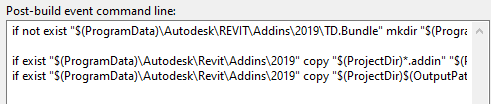
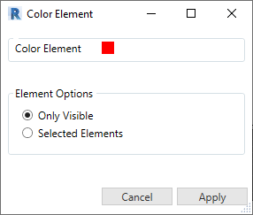
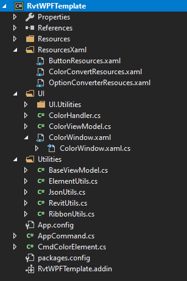
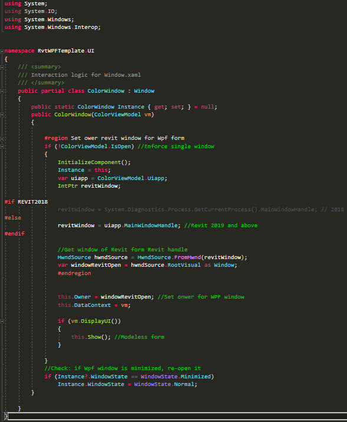

# Revit WPF Template
Template in visual studio for creating Revit C# .net addin with WPF

WPF in Revit API maybe make some difficulties for the first times to work with it.
As a beginner and a selt-touch developper, I waste many times to understand how does it works.
So, I create this template to using in my future other projects.

### About this template

In this template, I show how I use:
  - Organize project with MVVM pattern
  - Create and raise external event of Revit API with modeless form WPF
  - Binding command totally, not using event in code behind
  - Fix some problem with modeless forme: topmost, Window owner, minimize Window
  - Integrate type Window, Usercontrol in this template
  - Utils for image of icon of ribbon constrol Revit
  - Work with Json settings file
 
 
 ### How to use it?

* Clone/download this repository and open the .sln at the root of the repository with Microsoft Visual Studio.
* Re-link references to RevitAPI.dll and others which may be missing  and restore package from nuget package manager
* Build the solution - Building the solution will automatically create and copy the add-in files to the folder for Revit 2019.
Location  --  C:\ProgramData\Autodesk\Revit\Addins\2019\TD.Bundle
You can change it in Post-Built Event Command Line (Project --> Properties --> Build Event)

* In order to use this as a starter for your application, make sure you first refactor the content in the application files (namespace, assembly name, classes, GUID, etc.).
* You can create a template visual studio like the template Revit API of thebuildingcoder.
Follow the guide: [Create item template in Visual Studio](https://mathcadbimthingy.wordpress.com/2017/01/18/create-project-and-item-templates-in-visual-studio-revit-apiwpf-series-13/)
 
 
 
 UI Addin Exemple in template:
 
 
 

Demo:

#### Visual studio project
Tree Project

Code behind:

### Third Party
- Newtonsoft.Json
- System.Windows.Interactivity.WPF

### Licences
MIT © [Tien-Duy NGUYEN](https://github.com/tienduy-nguyen)

----------------------------------------------------------------------
Special thanks to [TheBuildingCoder](https://thebuildingcoder.typepad.com/blog/about-the-author.html) and [HOKGroup](http://www.hok.com) for helping me to complete my solution.

I hope my solution will be useful for you. 
Any suggestion and contributions are highly appreciated. 🙏
